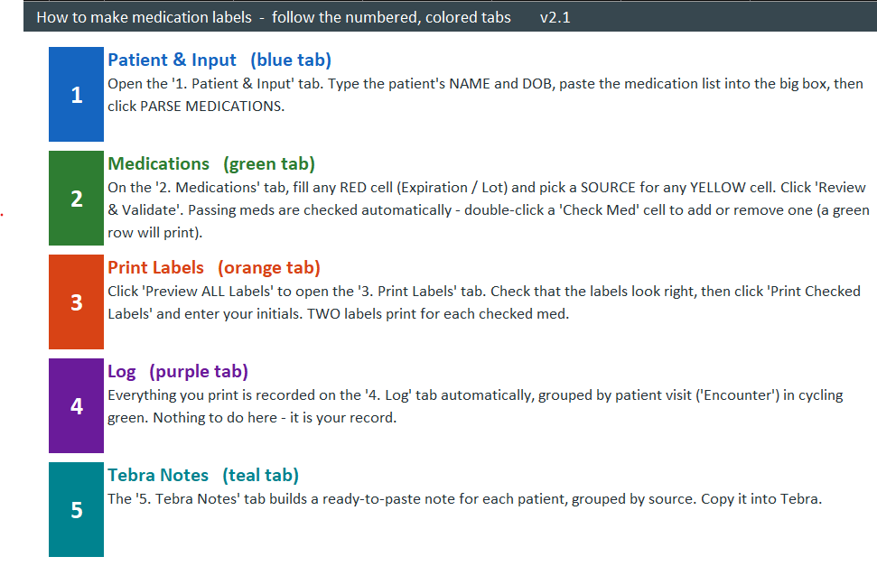
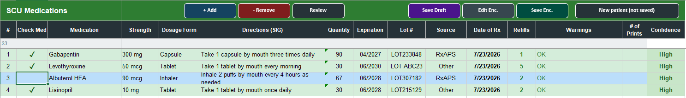
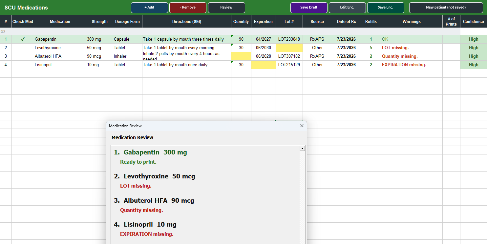
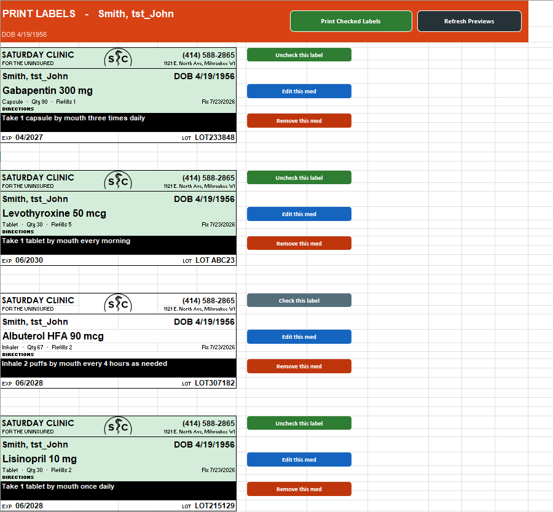
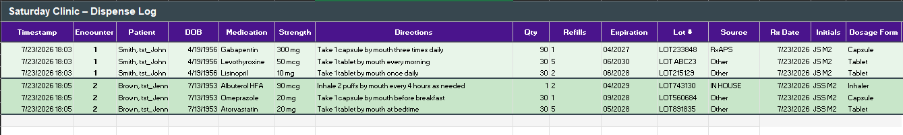
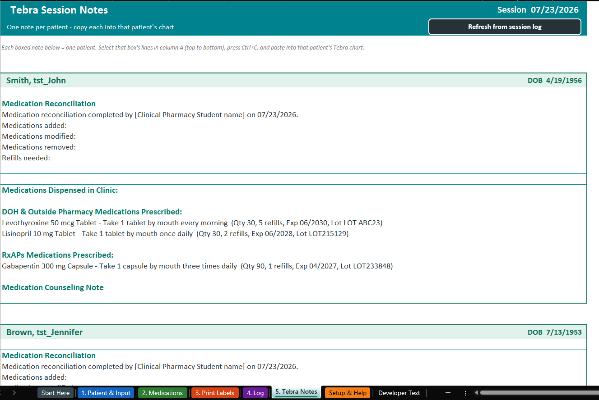

<!-- SCU Dispensary Label Tool -->

# 💊 SCU Dispensary Label Tool

---

**Paste a patient's prescriptions → get clean, validated medication labels — printed on a Brother QL-1100c (Hermione), with a running dispense log and paste-ready Tebra notes.**

Saturday Clinic for the Uninsured · Medical College of Wisconsin

`Excel + VBA` · `Brother QL-1100c (Hermione) — DK-1202` · `offline — no PHI committed` · `v2.4`

---

> **Are you trying to print lab labels?** That's a different tool.  
> → **[SCU Lab Label Tool](https://github.com/JamesSRN/lab-label-printer)** — name, DOB, and date on the small DK-1201 address roll.  
> This page is the **Dispensary** tool (medication labels on Hermione, DK-1202 shipping roll).

---

## Download — start here

### [⬇  Get the latest release](https://github.com/JamesSRN/scu-label-tool/releases/latest)

That's the ZIP a clinic manager needs. On the Releases page, under **Assets**, download **`SCU-Label-Printing-vX.Y.zip`**.

### 1 · Put it on the Desktop and Extract All

Windows will *look* like it opened the ZIP if you just double-click it — that is not enough, and Excel will misbehave.

1. **Move the ZIP onto the Desktop** (out of Downloads / OneDrive / email).
2. **Right-click the ZIP → Extract All… → Extract.**  
   You should get a real folder on the Desktop, with `OPEN LABEL TOOL (double-click me).cmd` inside it.
3. Keep that folder together. Don't scatter the files, and don't run anything from *inside* the ZIP window.

### 2 · One-time Excel Trust Center (required)

The tool rebuilds itself from source **every time you open it**, so Excel has to trust the **Desktop** (where you extract it) and the VBA project. Do this once on the clinic PC:

1. Open Excel (a blank workbook is fine).
2. **File → Options → Trust Center → Trust Center Settings…**
3. **Macro Settings** — check **Trust access to the VBA project object model**.  
   *(That's what lets the click-me file apply the latest code.)*
4. **Trusted Locations → Add new location…**  
   Browse to your **Desktop** (e.g. `C:\Users\<you>\Desktop`) — trust the whole Desktop, not just this one folder.  
   Check **Subfolders of this location are also trusted**. OK out of every window.
5. Close Excel completely.

If a yellow **Enable Content** bar appears the first time the workbook opens, click it.

> Trusting the **Desktop** (with subfolders) means every version you extract there just works — you won't have to re-add a Trusted Location each release. Keep the tool on the real Desktop, not OneDrive Desktop or Downloads.

### 3 · Every time you use it

| | Do this |
|---|---|
| **Open the tool** (every time) | Double-click **`OPEN LABEL TOOL (double-click me).cmd`** — that's the "click me" file |
| **If the click-me file doesn't work** | Double-click **`Build-Release.vbs`** instead |

> Close the workbook first, then use the click-me file.

Why the click-me file? (and what if it fails)

 

It runs `Build-Release.vbs` for you — rebuilds from the latest `MedParser.bas` and opens Excel — so you're never on stale code.

- If that file does nothing (Windows blocks `.cmd`, a window flashes and vanishes, etc.), skip it and double-click **`Build-Release.vbs`** yourself.
- Don't open the `.xlsm` by hand unless both of those fail.
- Leave the rest of the folder alone (`support/`, `tools/`, the `.bas` source, the emblem, and the bootstrap workbook) — the build needs it.

Printer: **Brother QL-1100c (Hermione)** with a **DK-1202 (62 × 100 mm)** roll loaded. Hermione needs a **USB cable** — she is not Bluetooth. The workbook opens to the **Start Here** guide.

When the roll runs out

 

**Keep the plastic spool** — don't throw it away. New DK-1202 labels load onto that same spool.

---

## How it works — five numbered tabs

The whole workflow lives on **five color-coded, numbered tabs**. The workbook opens to a built-in guide that walks you through them:

_All screenshots below use randomly generated test patients — no real patient data._

### 1 · Patient & Input  (blue)

1. Enter the patient's **name + DOB**.
2. Paste the prescription text into the big box.
3. Click **PARSE MEDICATIONS** (or press `Ctrl+Shift+P`).

What Parse does with the previous patient

 

Parse **clears the previous patient's list first** (keeping the name/DOB and the Log) so a new patient never mixes with old rows.

### 2 · Medications  (green)

Each drug becomes one row: name, strength, form, directions (SIG), quantity, refills, expiration, and lot.

- **Refills** default to **0**.
- **Source** is required — pick DOH / IN HOUSE / RxAPS / Other.

**Fill in missing cells (live as you type)**

- A missing **Quantity / Expiration / Lot / Source** cell is **yellow**.
- It clears to **white** the instant you fill it.

**Then click Review**

- Complete rows validate to **blue**.
- Review does **not** auto-check anything — you choose what prints.
- The Review pop-up lists each drug's **name + strength in bold**, with any issues stacked beneath.

**Choose what prints**

- Double-click a **Check Med** cell (or the medication name) to check one — it turns **green**.
- Double-click the **"Check Med" column header** to check / uncheck the whole list at once.

Row colors at a glance

 

- **Yellow cell** — missing
- **White** — filled, not yet reviewed
- **Blue** — reviewed OK
- **Green** — checked to print

**+ Add Medication** and **Edit this med** share the same one-dialog editor.

**Saving & editing a visit.** The toolbar's right side manages **encounters** — one patient visit.

- **Save Enc.** — stores the current patient
- **Save Draft** — parks an unfinished one (drafts are never printed)
- **Edit Enc.** — reopens a past encounter to fix and re-print it (re-saved edits show up in the Log as `1 (v2)`, `1 (v3)`, …)

The edit list is pulled **straight from the Log**, so it always matches what you see there. If you pasted a Log in from elsewhere, it offers to **auto-number** any blank encounters and **warns you instead of guessing** if the columns are out of order.

### 3 · Print Labels  (orange)

Every checked med auto-previews as a real label — drug + strength, directions, `form · qty · source · refills`, and Exp/Lot pinned to the bottom row (long patient names shrink to fit).

1. Click **Print Checked Labels**.
2. Enter your initials and confirm. **2 copies of each** print. The confirmation lists exactly what's about to print and flags any row skipped for missing Exp/Lot.
3. After it prints, you land on the **Log**.

> **Cancel = nothing prints.** If you cancel (or leave blank) the initials prompt, **nothing is printed or logged** and you're returned to this review page to try again. The same is true for the single **Print Label** and **Save Edited Encounter**.

Each label card also has its own buttons on the right:

- **Check / Uncheck this label**
- **Edit this med**
- **Remove this med**
- **Print extra (no log)** — spare physical labels only; **not** added to the Log and does **not** change the print count

### 4 · Log  (purple)

After **Print Checked Labels**, you land here. That's the record of what just printed.

Each print is one **encounter**: numbered, color-banded, and separated by a divider so each patient reads as one block.

**The Log is the source of truth** for Tebra Notes and for **Edit Encounter**. If a row is wrong or missing, fix it here.

**If a Log row needs a fix**, use the three buttons on the right of that row. Those buttons **keep you on the Log** — they do not jump to Tebra.

1. Find the row (wrong name, SIG, quantity, Exp/Lot, source, etc.).
2. Click **Edit**. The same one-dialog editor as the Print Labels page opens, already filled from that row. Change what's wrong and click OK. The Log row updates, and so does that day's CSV backup.
3. If you also need another physical sticker, click **Print** on that row. You get **one** copy. It is a reprint only — nothing is added to the Log again, and the print count does not change. You stay on the Log.
4. If the row shouldn't be there at all, click **Remove**, confirm, and it is deleted from the Log and from the CSV backup.

You can still type in a Log cell directly if that's faster (name, drug, SIG, qty, source, etc.), or add / delete a row by hand.

Then:

- Open **5 · Tebra Notes** — it rebuilds from whatever is in the Log *right now*. Copy the boxed note into Tebra. You do **not** have to re-print.
- Click **Edit Enc.** and pick that encounter — it reloads the patient and **every med from the Log**, including your button-edits and hand-edits. Then you can fix, uncheck, save, and reprint as usual.

**Print extra (no log)** on the Print Labels page does not add a Log row, so it will not show up here, in Tebra Notes, or in Edit Encounter. Drafts that were never printed live only in the snapshot store, not the Log.

### 5 · Tebra Notes  (teal)

1. Select a boxed note.
2. Copy it.
3. Paste it into that patient's Tebra chart.

If a note is wrong

 

The notes are built **from the Log** (including any rows you typed or corrected by hand) and **rebuild every time you open this tab**. Fix the Log first, then come back here. You do not have to re-print.

> **Between patients**
>
> - **Start NEW Patient** — clears the patient + med list but keeps the Log (run patient after patient)
> - **Reset Session** — wipes everything, Log included, for a fresh day

---

## Key features

- **One paste → labels**, with a per-drug **confidence** score; Parse starts a fresh list each time so patients never mix.
- **Validation before printing** — live color-coded cells (yellow = missing → white when filled) and a clear **white → blue (reviewed) → green (checked)** row state.
- **Readable pop-ups** — Review, Print, and Remove all show each med's name + strength in bold with its status beneath.
- **Required Source** dropdown (DOH / IN HOUSE / RxAPS / Other), logged on every row and **printed on the label** (on the qty line, before Refills).
- **Checkbox-driven** selection that drives printing, row color, and removal alike.
- **2 copies per label**, batch or single, with detailed confirmations and fit-to-page so the bottom row never clips.
- **Print extra (no log)** per-card button for spare labels a patient needs — printed without touching the dispense Log or the print count.
- **Complete dispense log** with numbered, color-banded **encounters** and a divider between each.
- **Per-row Log buttons** — **Print** (single reprint, not logged again), **Edit** (same one-dialog editor, writes back to the Log **and** its CSV backup), and **Remove** (row + CSV backup) on every Log row.
- **Cancel-safe initials** — cancelling the initials prompt prints and logs nothing and returns you to the review page.
- **Edit past encounters** — reopen any logged visit (the list is pulled live from the Log), fix it, and re-save as a new version; tolerant of pasted-in logs (auto-numbers blank encounters, warns on column mismatches).
- **Tebra notes** sheet: paste-ready session notes grouped by source, one boxed note per patient, rebuilt from the Log whenever you open the tab (fix the Log by hand if needed, then copy).
- **Brother QL-1100c (Hermione) auto-select** with a load-the-roll confirmation.

---

## Privacy

**This repo holds code and docs only.** The working `.xlsm` contains patient information and is kept **local** — excluded via `.gitignore`, never committed (as is `support/_backups/`). All screenshots in this README use **randomly generated test patients**.

---

If something won't open (macros blocked, click-me file errors)

 

- **Yellow bar / macros disabled** — click **Enable Content**. If that never appears, the Desktop isn't a Trusted Location yet (step 2 above). Close Excel and add it.
- **Click-me file does nothing** — Windows sometimes blocks `.cmd` files. Double-click **`Build-Release.vbs`** instead; that's the same rebuild, just without the helper script.
- **It says it can't access the VBA project** — the **Trust access to the VBA project object model** box isn't checked. That's required because we rebuild on every open.
- **You double-clicked the ZIP, not the extracted folder** — go back, **Extract All** onto the Desktop, then use the click-me file in *that* folder.
- **Workbook already open** — close `MedicationDispensing.xlsm` first (and any leftover Excel in Task Manager), then try the click-me file again.
- **OneDrive / cloud folder** — don't keep this tool in a synced folder. Desktop (not OneDrive Desktop) is the intended home.

Full notes: **[TROUBLESHOOTING.md](support/docs/TROUBLESHOOTING.md)**.

What's in the folder

 

**Main folder**

| File | What it is |
|---|---|
| `OPEN LABEL TOOL (double-click me).cmd` | **The everyday "click me" file** — rebuilds from `MedParser.bas` and opens the tool. |
| `Build-Release.vbs` | Same rebuild, used if the click-me file doesn't run. Imports `MedParser.bas`, runs `SetupWorkbook`, saves + opens the `.xlsm`. |
| `MedicationDispensing.xlsm` | The clinic workbook the click-me file / Build-Release builds + opens (local, git-ignored). Opening it directly skips the rebuild. |
| `MedParser.bas` | The VBA source of truth (parser, validation, label layout, printing, logging). |
| `scu_emblem.png` | SC emblem for the label header (loaded at print time; must stay here). |
| `README.md` | This file. |

**`support/docs/`** — `HANDOFF.md` (architecture / routine map), `CHANGELOG.md` (release history), `RELEASE.md`, `SETUP_INSTRUCTIONS.md`, `TROUBLESHOOTING.md`, `LABEL_REDESIGN.md`, `PRIVACY_AND_PHI.md`.

**`support/`** — `assets/` (emblem art + README screenshots), `test-data/` (no-PHI samples), `_backups/` (local snapshots, git-ignored).

**`tools/`** — `check-encoding.ps1` (pre-build ASCII/CRLF check), `make-release-zip.ps1`, `Build-ScuEmblem.ps1`, `BUILD_RELEASE_NOTES.md`.

Coding, manual build, and maintainer notes

 

There's no separate "apply updates" step. Every time you open the tool with the **click-me file** (`OPEN LABEL TOOL`), it rebuilds the workbook from the latest `MedParser.bas` and opens it. After a `git pull`, just open the tool the usual way. If the click-me file doesn't run, double-click **`Build-Release.vbs`**.

- **Manual build (VBA editor):** remove the `MedParser` module, **Import** `MedParser.bas`, run `SetupWorkbook`, save.
- **After changing the emblem crop:** run `tools/Build-ScuEmblem.ps1` first, then `Build-Release.vbs`.
- The two worksheet event handlers are pasted once into the sheet modules — see `HANDOFF.md` §5.
- Everything lives in **one folder** (outside OneDrive). Code + docs are version-controlled; the `.xlsm` and `support/_backups/` are git-ignored so patient data stays local.

| I want to… | Go to |
|---|---|
| Cut a GitHub release | [RELEASE.md](support/docs/RELEASE.md) |
| Understand the code (routine map) | [HANDOFF.md](support/docs/HANDOFF.md) |
| See what changed | [CHANGELOG.md](support/docs/CHANGELOG.md) |
| De-novo PC setup | [SETUP_INSTRUCTIONS.md](support/docs/SETUP_INSTRUCTIONS.md) |
| Read the PHI / privacy rules | [PRIVACY_AND_PHI.md](support/docs/PRIVACY_AND_PHI.md) |

**Known open items**

- **Print width** — `LABEL_WIDTH_PT = 242` uses more of the 100 mm die-cut; re-test on the clinic Brother that labels still fit one die-cut (228 pt was the prior no-bleed value).
- **Bold clinic title on thermal** — may still look subtle; `ShrinkToFit` can limit apparent size.
- **Physical regression test** — spot-check the emblem and header on the Brother thermal (screen + print path verified).

